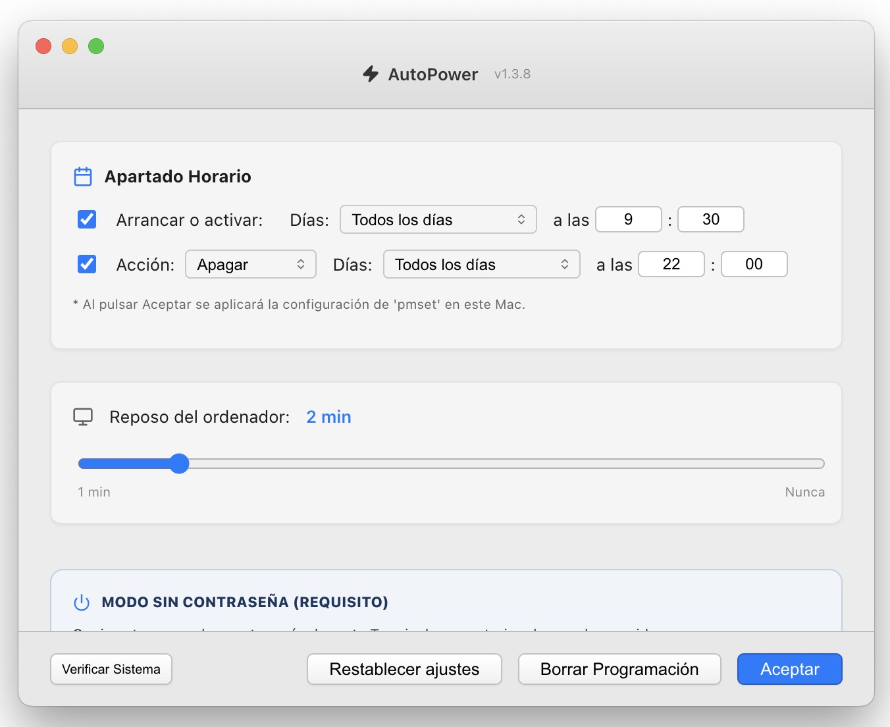

# AutoPower-1.3.8-universal
AutoPower: Intelligent Power Control for macOS

AutoPower is the ultimate tool for managing your Mac’s power on, shutdown, and sleep automatically and professionally. Designed exclusively for macOS, this application combines an elegant, minimalist interface with the system’s powerful engine to give you complete control over your device’s energy consumption.

Main Features:

Advanced Scheduling: Set specific schedules to power on, shut down, restart, or put your computer to sleep. Whether it’s “every day,” “weekdays,” or “weekends,” AutoPower adapts to your routine.

Smart Persistence: Your settings are automatically saved and restored when the app launches, ensuring your schedules are never lost.

Global Support: AutoPower automatically detects your system language (Spanish, English, French, German, Italian, and Portuguese) and local time format (AM/PM or 24-hour), delivering a native experience wherever you are.

Password-Free Mode: Includes a setup assistant to authorize the app via Terminal, allowing your settings to be applied instantly without asking for the administrator password every time (requires a password to be set on the system).

Diagnostic Tools: The “Verify System” feature lets you check macOS’s active power schedule in real time, giving you peace of mind that everything is configured correctly.

Security and Control: With the “Clear Schedule” button, you can instantly remove all scheduled system events with a single click.

Optimize your workflow, save energy, and extend the lifespan of your hardware with AutoPower—the simple yet powerful solution for a Mac that’s always ready.

AutoPower

AutoPower is a macOS application that allows you to schedule power events (startup, shutdown, sleep, and restart) automatically and persistently.

Features

Flexible Scheduling: Configure specific days and times for each action.

Internationalization: Automatic detection of language and time format (AM/PM or 24-hour).

Persistence: Settings are automatically saved between sessions.

Sleep Control: Adjust idle time for monitor and disk sleep.

Diagnostics: Verify the system’s real status with a single click.

What's New in Version 1.3.8

Headline: Now a Universal App with Native Apple Silicon Support.
Release Notes:

Universal Binary: AutoPower now runs natively on both Intel and Apple Silicon processors (M1, M2, M3, and M4). 
No Rosetta 2 translation required.
Optimized Performance: Experience faster launch times and significantly reduced battery consumption on the latest Mac models.
Architecture Verification: The installer now includes both x86_64 and arm64 architectures, ensuring 100% compatibility across the entire Mac lineup.
Enhanced Stability: Internal improvements to the power scheduling engine for more reliable automation.

Technical Summary (Para los campos de especificaciones)
Architecture: Universal (Apple Silicon & Intel).
Native Support: M1, M2, M3, M4 series.
Compatibility: macOS 12.0 Monterey or later.
File Format: .dmg (Universal Installer).

Smart Language Detection: AutoPower speaks your language. The app elegantly senses your Mac's system settings to automatically present itself in English, Spanish, French, German, Italian, or Portuguese, providing a truly native experience from the very first click.

Performance: No more Rosetta. Just pure, native speed.

# AutoPower

**AutoPower** is a powerful, **completely free** utility designed to manage your Mac's startup, shutdown, and sleep cycles automatically and professionally.

## 📸 Screenshots

---

### 🌍 Global Experience
AutoPower is designed to feel native wherever you are. The app **elegantly senses your Mac's system language**, automatically presenting its interface in English, Spanish, French, German, Italian, or Portuguese for a seamless, intuitive experience.

---

### 🚀 Download & Support (Free Software)
AutoPower is **100% free to use**. If it makes your life easier, consider fueling its development with a coffee!

* **Direct Download:** [AutoPower-1.3.8-universal.dmg](https://github.com/mariateresafernandesmadrid-lgtm/AutoPower-1.3.8-universal/releases/download/AutoPower-1.3.8-universal/AutoPower-1.3.8-universal.dmg)
* **Support the Project:** ☕ **[Buy me a coffee on Ko-fi](https://ko-fi.com/terry12207)**

---

### 💻 System Requirements
* **Architecture:** Universal (Native support for M1, M2, M3, M4 & Intel).
* **OS:** macOS 12.0 Monterey or later.
* **License:** Free / Open Support.
